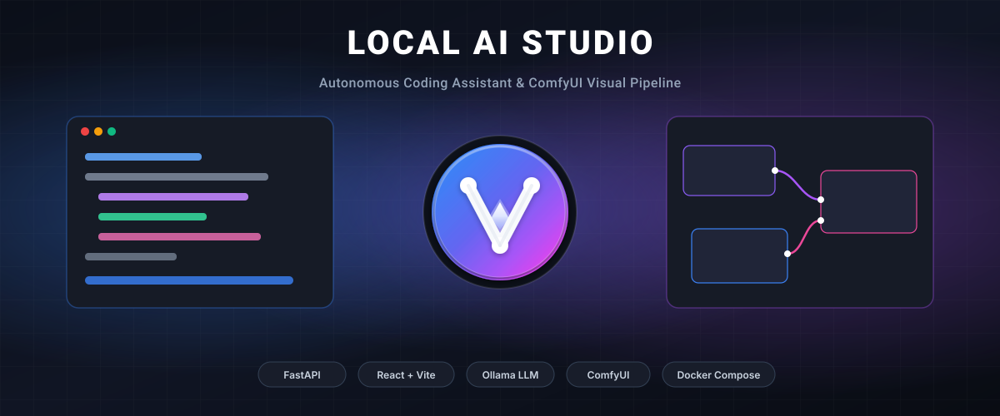

<p align="center">
  
</p>

# Local AI Studio

Self-hosted AI Development Environment: Autonomous Code Assistant & Visual Generation.

[English](#english) | [Русский](#русский)

---

## English

> ### ⚠️ WORK IN PROGRESS / IN ACTIVE DEVELOPMENT
> **Notice:** This project is currently in early active development. APIs, architecture, and UI features are subject to frequent changes and improvements.

### Overview
Local AI Studio is a self-hosted workspace combining local Large Language Models (LLMs via Ollama) and image generation pipelines (ComfyUI). It provides a full developer workflow for creating, refactoring, and previewing code alongside AI-assisted visual asset production—all containerized and private.

### Architecture & Key Features
- **Decoupled Containerization:** Microservices architecture with FastAPI (backend), React/Vite (frontend), and MongoDB (mongo) managed by Docker Compose.
- **Agentic Code Generation & Editing:** Autonomous LLM-driven file manipulation, project tree navigation, and code history revision tracking with snapshot recovery.
- **Integrated Image Pipeline:** Prompt-to-image workflow directly within the workspace with built-in asset storage and base64 hover previews.
- **Configurable Workspace Paths:** Dynamic host-to-container volume mapping for workspace projects.

---

### Prerequisites & External Services

#### 1. Ollama Setup (LLMs & Translation)
Ollama runs locally outside or inside your environment. The studio uses specialized models for reasoning and text processing:
- **Code & Chat Model:** `qwen2.5-coder:7b` (or `deepseek-coder-v2`, `llama3.1`).
- **Built-in Translation Models (Two-stage bridge):** Prompt enrichment uses two integrated models (e.g. `qwen2.5:7b` / `llama3.2`) to bridge Russian/multilingual developer prompts to optimized English ComfyUI prompts.

Pull recommended models:
```bash
ollama pull qwen2.5-coder:7b
ollama pull llama3.2:latest
```

#### 2. ComfyUI Setup (Image Generation)
Make sure ComfyUI is running with API access enabled (`--listen 0.0.0.0`).
- **Required Custom Nodes:**
  - ComfyUI-Manager
  - ComfyUI-Custom-Scripts
- **Required Checkpoints / Models:**
  - Standard SDXL / SD1.5 or Flux checkpoints in `ComfyUI/models/checkpoints/` (e.g., `sd_xl_base_1.0.safetensors`).
  - Corresponding VAE and CLIP models according to your generation workflow.

---

### Quick Start & Deployment

1. **Clone the repository:**
```bash
git clone <repo-url> local-ai-studio
cd local-ai-studio
```

2. **Configure Environment (.env):**
```bash
cp .env.example .env
```
Key variables in `.env`:
```env
# Local directory on host to mount projects into workspace
PROJECTS_DIR=./projects

# Port bindings
BACKEND_PORT=8000
FRONTEND_PORT=3000
MONGO_PORT=27017

# Integration endpoints
OLLAMA_URL=http://host.docker.internal:11434
COMFY_URL=http://host.docker.internal:8188
MONGO_URI=mongodb://mongo:27017/local_ai_studio
```

3. **Run via Docker Compose:**
```bash
docker compose up -d
```
Open `http://localhost:3000` in your browser.

---

## Русский

> ### ⚠️ ВНИМАНИЕ: ПРОЕКТ НАХОДИТСЯ В СТАДИИ РАЗРАБОТКИ
> **Примечание:** Проект находится в стадии активной разработки и тестирования (WIP). Интерфейс, логика работы агентов и структура API могут активно изменяться и дополняться.

### Описание проекта
Local AI Studio — это локальная среда разработки и генерации, объединяющая возможности локальных языковых моделей (LLM через Ollama) и генерации изображений (ComfyUI). Платформа предоставляет интерфейс для кодогенерации, навигации по проектам, ревизии версий файлов и создания графических ассетов прямо в проекте без передачи данных во внешние облака.

### Архитектура и функционал
- **Полная контейнеризация:** Связка контейнеров FastAPI (backend), React/Vite (frontend) и MongoDB (mongo) под управлением Docker Compose.
- **Агентное редактирование кода:** Чат-ассистент, способный анализировать контекст файлов, вносить изменения и фиксировать снимки истории (Revision History) с возможностью быстрого отката.
- **Генерация визуальных ассетов:** Встроенный интерфейс генерации картинок через ComfyUI с автоматическим сохранением графики в выбранную папку активного проекта.
- **Гибкое управление путями:** Путь к локальным проектам меняется строго через `.env` без правок в коде приложения.

---

### Требования и интеграции

#### 1. Установка и настройка Ollama
Ollama запускается на локальной машине:
- **Основная модель для кода и агента:** `qwen2.5-coder:7b` (или `deepseek-coder`).
- **Модели для перевода (2 встроенные модели):** Для корректного составления промптов в ComfyUI используется двухэтапная цепочка перевода: модели переводят и адаптируют запросы с русского языка на специализированный английский синтаксис промптов.

Команды для скачивания моделей:
```bash
ollama pull qwen2.5-coder:7b
ollama pull llama3.2:latest
```

#### 2. Настройка ComfyUI
ComfyUI должен быть запущен с открытым сетевым доступом (`--listen 0.0.0.0`):
- **Необходимые Custom Nodes:**
  - ComfyUI-Manager
  - Ноды для работы с WebSocket API (ComfyUI-Custom-Scripts и вспомогательные пайплайны).
- **Модели и чекпоинты:**
  - Базовые модели генерации (`sd_xl_base_1.0.safetensors`, `v1-5-pruned-emaonly.safetensors` или Flux) в папке `ComfyUI/models/checkpoints/`.

---

### Развертывание и запуск

1. **Клонирование репозитория:**
```bash
git clone <repo-url> local-ai-studio
cd local-ai-studio
```

2. **Настройка файла переменных (.env):**
```bash
cp .env.example .env
```
Основные переменные:
```env
# Папка на вашем диске, в которой лежат проекты:
PROJECTS_DIR=./projects

# Сетевые порты сервисов:
BACKEND_PORT=8000
FRONTEND_PORT=3000
MONGO_PORT=27017

# Адреса внешних локальных сервисов:
OLLAMA_URL=http://host.docker.internal:11434
COMFY_URL=http://host.docker.internal:8188
MONGO_URI=mongodb://mongo:27017/local_ai_studio
```

3. **Запуск контейнеров:**
```bash
docker compose up -d
```
Интерфейс доступен по адресу `http://localhost:3000`.
