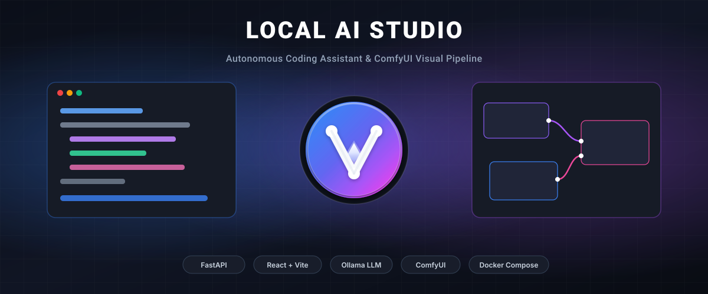

<p align="center">
  
</p>

# Local AI Studio

Self-hosted AI Development Environment: Autonomous Code Assistant & Visual Generation.

[English](#english) | [Русский](#русский)

---

## English

> ### ⚠️ WORK IN PROGRESS / IN ACTIVE DEVELOPMENT
> **Notice:** This project is currently in early active development. APIs, architecture, and UI features are subject to frequent changes and improvements.

### Overview
Local AI Studio is a self-hosted workspace combining local Large Language Models (LLMs via Ollama) and image generation pipelines (ComfyUI). It provides a full developer workflow for creating, running, refactoring, and previewing code alongside AI-assisted visual asset production—all containerized and private.

### Architecture & Key Features
- **Decoupled Containerization:** Microservices architecture with FastAPI (backend), React/Vite (frontend), and MongoDB (mongo) managed by Docker Compose.
- **Unified Project Lifecycle Management:** Native runtime controls (Start/Stop) for Docker Compose and Python services directly from the project explorer.
- **Multi-Engine Interactive Preview:** Automatic routing between static HTML renderers, external Docker exposed ports, and an integrated FastAPI reverse-proxy for background Python applications with cache-busting (?_t=timestamp).
- **Dual-Pane Bottom Workspace:** Interactive xterm.js terminal alongside an API diagnostic Console with per-project request/response tracing, collapsible view, and vertical resizing.
- **Instant Chat-Driven Project Scaffolding:** Create structured projects directly through natural language chat commands or manually via the project tree.
- **Agentic Code Generation & Editing:** Autonomous LLM-driven file manipulation, project tree navigation, and code history revision tracking with snapshot recovery.
- **Integrated Image Pipeline:** Prompt-to-image workflow directly within the workspace with built-in asset storage and base64 hover previews.
- **Context Isolation & Overflow Protection:** Dual-layer memory architecture: MongoDB preserves 100% of historical messages and Base64 media, while the inference context window dynamically suppresses historical image payloads and uses a 16,384-token sliding window (num_ctx: 16384) to prevent context exhaustion.

---

### Project Snapshots & Backup Management

Local AI Studio provides full project archive management through the collapsible **BACKUPS** panel located in the left sidebar:

- **Isolated Storage:** Backups are stored as `.zip` archives within the `.backups` directory of each project and excluded from recursive archiving, `.git`, `.venv`, and node modules.
- **Manual Snapshot Creation (`+`):** Clicking the plus button prompts an English confirmation dialog, followed by an animated real-time progress bar during archive compilation.
- **Instant UI Refresh:** Created archives appear immediately without page reload, formatted with human-readable timestamps (`DD.MM.YYYY HH:MM:SS`) and exact file size in Megabytes (e.g. `(0.12 MB)`).
- **One-Click Restoration:** Dedicated restore action with confirmation safeguards: clears the project directory while keeping `.backups`, extracts the selected snapshot, and refreshes the project tree automatically.
- **Snapshot Deletion:** Remove outdated archives directly from the list with confirmation.
- **Diagnostics & Audit Trail:** Every backup action (`GET list`, `POST create`, `POST restore`, `DELETE`) is captured by the diagnostic **Console** tab with duration, HTTP status, and payload details.

---

### Supported Project Types & Scaffolding

You can scaffold projects on the fly using natural language commands in the Global Chat (English or Russian), or create directories manually using the New Project button in the sidebar:

#### 1. Static Web Project
- **Chat Triggers:** `create static project <name>`, `создай статичный проект <имя>`
- **Generated Templates:**
  - `index.html` (semantic HTML5 boilerplate with stylesheet and script links)
  - `images/` (empty directory for visual assets)
  - `css/style.css` (modern reset and dark theme starter styling)
  - `js/script.js` (DOM initialization listener)
- **Lifecycle & Execution:** No server process required. Served directly by the backend preview handler.

#### 2. Docker Compose Project
- **Chat Triggers:** `create docker project <name>`, `создай докер проект <имя>`
- **Generated Templates:**
  - `app/index.html` (sample web document)
  - `docker-compose.yml` (production-ready `nginx:alpine` container with port `8080:80` and `./app` volume mount)
- **Lifecycle & Execution:** Controlled via `POST /api/projects/{name}/compose/up` and `POST /api/projects/{name}/compose/down`.

#### 3. Python Project
- **Chat Triggers:** `create python project <name>`, `создай пайтон проект <имя>`
- **Generated Templates:**
  - `main.py` (`def main():` entrypoint or lightweight HTTP server listening to dynamic `os.environ["PORT"]`)
  - `requirements.txt` (standard dependencies: `requests`, `pydantic`, `python-dotenv`)
- **Lifecycle & Execution:** Managed by the backend Process Manager (`POST /api/projects/{name}/python/start` and `stop`), executing in the background with dynamic port allocation (8050–8099).
- **Automated Virtual Environment & Dependency Isolation:**
  - Automatically provisions an isolated `.venv` inside the project folder using `--system-site-packages` (enabling seamless host SOCKS5 proxy compatibility via `PySocks`).
  - Automatically runs `pip install -r requirements.txt` during startup.
  - **MD5 Hash Caching:** Tracks changes via `.reqs_hash`. Dependencies are re-installed only when `requirements.txt` changes, keeping subsequent launches instantaneous (~30ms).
  - **Diagnostic Output in Console:** Detailed step-by-step logs (environment provisioning, downloaded wheels, cache hits, or pip warnings) are streamed directly into the bottom **Console** tab under `setup_log`.

---

### Project Preview System

Clicking the Preview button (external link icon) next to any project resolves automatically depending on the project type:

1. **Docker Compose Projects:** When running, reads the exposed host port from container metadata (e.g. `8080`) and opens `http://<host>:<port>/?_t=<timestamp>`.
2. **Python Projects:** Routes through the built-in transparent reverse-proxy:
   `http://<host>:8000/api/projects/<name>/python/proxy/?_t=<timestamp>`
   This forwards requests directly to the internal loopback port (`127.0.0.1:<allocated_port>`) without requiring manual Docker port exposure on macOS host.
3. **Static Projects:** Opens the static HTML renderer endpoint:
   `http://<host>:8000/api/projects/<name>/preview/?_t=<timestamp>`

*Note: All preview URLs append a timestamp query parameter (?_t=Date.now()) to ensure browser cache busting.*

---

### Bottom Drawer: Terminal & API Debug Console

The bottom area occupies 1/3 of the central workspace, supports vertical resizing, and can be collapsed or expanded at any time:

- **Terminal Tab:**
  - Full VT100/ANSI emulation with xterm.js and WebSocket PTY sessions.
  - Automatically synchronizes working directory to `projects/<selected-project>`.
  - Shell reload and screen clear buttons.
- **Console Tab (API Debugger):**
  - Live inspection stream of lifecycle API calls (`compose/up`, `compose/down`, `python/start`, `python/stop`).
  - Color-coded badges for HTTP requests (`-> REQ`), responses (`<- RES 200`), status codes, and execution latency (`ms`).
  - Collapsible JSON payloads for both requests and server responses.
  - **Per-Project Isolation:** Each project maintains its own isolated event history.
  - **Clear Button:** Clears logged events for the currently active project.

---

### Prerequisites & External Services

#### 1. Ollama Setup (LLMs & Translation)
Ollama runs locally outside or inside your environment:
- **Code & Chat Model:** `qwen2.5-coder:7b` (or `deepseek-coder-v2`, `llama3.1`).
- **Translation Bridge:** Prompt enrichment uses two integrated models (e.g. `qwen2.5:7b` / `llama3.2`) to bridge multilingual developer prompts into optimized English ComfyUI tags.

Recommended models:
- `ollama pull qwen2.5-coder:7b`
- `ollama pull llama3.2:latest`

#### 2. ComfyUI Setup (Image Generation)
Make sure ComfyUI is running with API access enabled (`--listen 0.0.0.0`):
- **Custom Nodes:** ComfyUI-Manager, ComfyUI-Custom-Scripts.
- **Checkpoints:** SDXL, SD1.5 or Flux checkpoints in `ComfyUI/models/checkpoints/`.

---

### Quick Start & Deployment

1. Clone the repository:
   `git clone <repo-url> local-ai-studio`
   `cd local-ai-studio`

2. Configure Environment:
   `cp .env.example .env`

Key variables:
- `PROJECTS_DIR=./projects`
- `BACKEND_PORT=8000`
- `FRONTEND_PORT=3000`
- `MONGO_PORT=27017`
- `OLLAMA_URL=http://host.docker.internal:11434`
- `COMFY_URL=http://host.docker.internal:8188`
- `MONGO_URI=mongodb://mongo:27017/local_ai_studio`
- `DEFAULT_CODER_MODEL=qwen2.5-coder:7b-instruct-q4_K_M`
- `TRANSLATOR_MODEL=dolphin-llama3:latest`
- `VISION_MODEL=minicpm-v:latest`

3. Run via Docker Compose:
   `docker compose up -d`

Open `http://localhost:3000` in your browser.

---


---

### Model Context Protocol (MCP) File Operations

Local AI Studio utilizes the Model Context Protocol (MCP) tool standard (`services/mcp_client.py`) for decoupled, containerized workspace manipulation. When tasks are executed through the **Project Agent**, LLM completions are parsed into deterministic file-system actions (`write_file`, `read_file`, `list_files`).

- **Natural Language Translation to MCP Calls:** You do not need to invoke JSON schemas or tool names manually. Natural requests are automatically mapped to targeted MCP write/update events.
- **Streaming & Live UI Synchronization:** Modifying or generating files triggers streaming updates directly into open Monaco editor tabs, followed by disk persistence and revision history snapshots.
- **Structured Operation Logging:** File operations return non-conversational reports in concise standard output syntax (`File created`, `File modified`, `Directory created`).

#### Example Prompts for File Agent & MCP Server

| Goal | Example Natural Language Prompt | MCP Actions & Result |
| :--- | :--- | :--- |
| **Create a new file** | `Create contact.html with a feedback form, modern CSS styling, and a link back to index.html` | Inspects workspace via `list_files`, opens a new editor tab, streams code, and writes file via `write_file`. |
| **Targeted single-file edit** | `Update index.html to add a three-column features section and hero banner` | Reads active context, replaces/updates contents directly in `index.html` without affecting other assets. |
| **Multi-file project scaffolding** | `Scaffold a responsive landing page with index.html, css/style.css, and js/app.js` | Emits distinct `[FILE: path]...[/FILE]` blocks, automatically creates missing subfolders, and commits multiple files. |
| **Generate & link visual assets** | `Generate an illustration of a mechanical keyboard and embed it into index.html` | Dispatches image generation task to ComfyUI, saves binary to project root, and links asset accurately in HTML tags. |

**Standard Output Report:**
```text
Directory created: css/
File created: css/style.css
File created: index.html
File modified: js/app.js
```

## Русский

> ### ⚠️ ВНИМАНИЕ: ПРОЕКТ НАХОДИТСЯ В СТАДИИ РАЗРАБОТКИ
> **Примечание:** Проект находится в стадии активной разработки и тестирования (WIP). Интерфейс, логика работы агентов и структура API могут активно изменяться и дополняться.

### Описание проекта
Local AI Studio — это локальная среда разработки и генерации, объединяющая возможности локальных языковых моделей (LLM через Ollama) и генерации изображений (ComfyUI). Платформа предоставляет единый интерфейс для кодогенерации, навигации по проектам, версионирования файлов, управления жизненным циклом сервисов и создания графических ассетов без передачи данных в публичные облака.

### Архитектура и функционал
- **Полная контейнеризация:** Микросервисная архитектура FastAPI (бэкенд), React/Vite (фронтенд) и MongoDB (база данных) под управлением Docker Compose.
- **Единое управление запуском и остановкой:** Кнопки запуска и остановки (Play / Stop) прямо в дереве проектов для контейнеров Docker Compose и фоновых скриптов Python.
- **Умная система интерактивного превью:** Автоматическая маршрутизация между статическими HTML-файлами, внешними портами Docker и встроенным Reverse-proxy для Python с автоматическим сбросом кэша браузера (?_t=timestamp).
- **Нижняя панель (Terminal + Console):** Сплит-панель с полноценным веб-терминалом на базе xterm.js и окном диагностической консоли для отслеживания API-запросов запуска/остановки с индивидуальной историей по проектам.
- **Генерация шаблонов проектов через чат:** Мгновенная инициализация проектов по текстовым запросам или вручную через интерфейс.
- **Агентное редактирование кода:** Ассистент анализирует контекст файлов, создаёт правки и фиксирует снимки истории (Revision History) с возможностью быстрого отката.
- **Интегрированная генерация изображений:** Встроенный интерфейс создания картинок через ComfyUI с сохранением в папку активного проекта и предпросмотром при наведении.
- **Защита контекста от переполнения:** MongoDB сохраняет полную историю сообщений и Base64-вложений, тогда как в окно LLM инференса передается скользящее окно с изоляцией тяжелых картинок и лимитом в 16 384 токенов (num_ctx: 16384).

---

### Управление резервными копиями (Backups)

Local AI Studio оснащена встроенной системой снапшотов с отдельной панелью **BACKUPS** в левом сайдбаре:

- **Изолированное хранение:** Архивы сохраняются в поддиректории `.backups` внутри папки конкретного проекта. При создании архива служебные каталоги (`.backups`, `.git`, `.venv`, `node_modules`) автоматически исключаются.
- **Ручное создание снимка (`+`):** Клик по кнопке открывает модальное окно подтверждения и запускает процесс архивации с анимированным индикатором прогресса (Progress Bar).
- **Моментальное обновление:** Созданный архив мгновенно появляется в списке без перезагрузки интерфейса с указанием даты/времени (`ДД.ММ.ГГГГ ЧЧ:ММ:СС`) и размера архива в мегабайтах (например, `(0.12 MB)`).
- **Восстановление проекта в 1 клик:** Иконка восстановления открывает диалог подтверждения с предупреждением. При согласии текущее содержимое проекта очищается (папка `.backups` сохраняется), архив распаковывается, а дерево файлов моментально перечитывается.
- **Удаление архивов:** Любой архив можно удалить прямо из панели с предварительным подтверждением.
- **Дебаггинг в Console:** Все вызовы API бэкапов (`GET`, `POST create`, `POST restore`, `DELETE`) детально логируются во вкладку **Console** с фиксацией времени ответа и JSON-пейлоадов.

---

### Поддерживаемые типы проектов и шаблоны

Создать проект можно с помощью текстовой команды в общем чате или нажатием кнопки «New Project» в боковой панели:

#### 1. Статичный веб-проект (Static)
- **Команды в чате:** `создай статичный проект <имя>`, `create static project <name>`
- **Шаблоны файлов:**
  - `index.html` (семантическая разметка HTML5 с подключением CSS и JS)
  - `images/` (папка для графических ассетов)
  - `css/style.css` (базовые стили и тёмная тема)
  - `js/script.js` (обработчик события загрузки DOM)
- **Запуск:** Не требует серверного процесса, обслуживается встроенным статическим обработчиком.

#### 2. Docker-проект (Docker Compose)
- **Команды в чате:** `создай докер проект <имя>`, `create docker project <name>`
- **Шаблоны файлов:**
  - `app/index.html` (стартовая веб-страница сервиса)
  - `docker-compose.yml` (контейнер `nginx:alpine` с пробросом порта `8080:80` и монтированием каталога `./app`)
- **Запуск и остановка:** Управляются кнопками в дереве проектов через эндпоинты `/api/projects/{name}/compose/up` и `/compose/down`.

#### 3. Python-проект (Python)
- **Команды в чате:** `создай пайтон проект <имя>`, `create python project <name>`
- **Шаблоны файлов:**
  - `main.py` (точка входа или HTTP-сервер, слушающий порт из переменной окружения `os.environ.get("PORT")`)
  - `requirements.txt` (зависимости: `requests`, `pydantic`, `python-dotenv`)
- **Запуск и остановка:** Управляются встроенным менеджером процессов бэкенда (`/api/projects/{name}/python/start` и `/stop`) с автоматическим выделением свободного порта из диапазона 8050–8099.
- **Изолированное окружение и управление зависимостями:**
  - Автоматически создает локальный `.venv` в директории проекта с флагом `--system-site-packages` (поддерживает работу через корпоративные/SOCKS5-прокси без сбоев `urllib3`).
  - При старте сервиса автоматически выполняет установку библиотек: `.venv/bin/pip install -r requirements.txt`.
  - **Кэширование по MD5-хешу:** Файл `.reqs_hash` отслеживает изменения. Повторные запуски происходят мгновенно (~30 мс) без повторных обращений к PyPI.
  - **Логи установки в Консоли:** Все шаги подготовки окружения и вывод `pip install` транслируются в нижнюю вкладку **Console** в поле `setup_log`.

---

### Механизм интерактивного превью (Preview)

Нажатие на кнопку Preview (иконка внешней ссылки со стрелкой) автоматически определяет тип проекта:

1. **Docker Compose:** Если контейнеры запущены, считывается внешний порт (например, `8080`) и в новой вкладке открывается `http://<host>:<port>/?_t=<timestamp>`.
2. **Python-проекты:** Запрос направляется на встроенный прозрачный reverse-proxy бэкенда:
   `http://<host>:8000/api/projects/<name>/python/proxy/?_t=<timestamp>`
   Бэкенд сам перенаправляет трафик на локальный порт процесса (`127.0.0.1:<port>`) внутри контейнера без ручного проброса портов в Compose.
3. **Статические проекты:** Открывается прямой роут предпросмотра:
   `http://<host>:8000/api/projects/<name>/preview/?_t=<timestamp>`

*Каждый URL снабжён меткой времени `?_t=Date.now()`, предотвращающей кэширование браузером.*

---

### Нижняя панель: Terminal и отладочная Console

Нижняя область занимает 1/3 высоты центрального экрана, масштабируется мышью по высоте и сворачивается в полосу:

- **Вкладка Terminal:**
  - Полноценная эмуляция VT100/ANSI на xterm.js через WebSocket PTY.
  - Автоматическая смена рабочей директории на `projects/<выбранный-проект>`.
  - Кнопки перезапуска сессии и очистки экрана.
- **Вкладка Console (Дебаггер API):**
  - Живое логирование вызовов запуска и остановки (`compose/up`, `compose/down`, `python/start`, `python/stop`).
  - Цветовая индикация запросов (`-> REQ`), ответов (`<- RES 200`), ошибок (`X ERR`) и миллисекунд выполнения.
  - JSON-просмотр тел запросов и ответов бэкенда.
  - **Раздельная история по проектам:** У каждого проекта свой независимый журнал логов.
  - **Кнопка очистки:** Сбрасывает журнал активного проекта.

---

### Развертывание и запуск

1. Клонирование репозитория:
   `git clone <repo-url> local-ai-studio`
   `cd local-ai-studio`

2. Файл переменных окружения:
   `cp .env.example .env`

3. Запуск контейнеров:
   `docker compose up -d`

Студия откроется по адресу `http://localhost:3000`.

---

### Работа с файловой системой через Model Context Protocol (MCP)

В Local AI Studio операции с файлами проекта изолированы через протокол Model Context Protocol (MCP) с помощью сервиса `services/mcp_client.py`. Агент (**Project Agent**) принимает инструкции на естественном языке, а бэкенд транслирует их в вызовы MCP (`write_file`, `read_file`, `list_files`).

- **Естественный язык без ручного вызова функций:** Пользователю не требуется формировать JSON-вызовы или перечислять системные аргументы `write_file`. Система самостоятельно выделяет пути к файлам и контекст задачи.
- **Интерактивный стриминг в редактор:** При генерации или изменении файла в интерфейсе автоматически активируется соответствующая вкладка, отображается посимвольный вывод кода, а после завершения создаётся моментальный снимок версии (File History).
- **Лаконичный отчёт вместо диалога:** Ассистент не выводит лишних рассуждений или вводных слов, возвращая строгий технический отчёт о статусе операций.

#### Примеры промптов для работы с файлами

| Задача | Пример промпта для Project Agent | Поведение системы и MCP |
| :--- | :--- | :--- |
| **Создание нового файла** | `Создай страницу about.html с формой контактов, стилями и ссылкой на index.html` | Проверяет дерево файлов, открывает новую вкладку `about.html`, генерирует код и сохраняет через `write_file`. Открытый `index.html` не перезаписывается. |
| **Точечное изменение файла** | `Измени index.html: добавь блок преимуществ из трёх колонок и подвал сайта` | Обновляет код текущего файла на лету, сохраняет изменения и фиксирует снимок в истории версий. |
| **Генерация каркаса из нескольких файлов** | `Создай проект портфолио с файлами index.html, css/style.css и js/main.js` | Генерирует блоки `[FILE: ...]`, автоматически создаёт папки `css/` и `js/`, после чего записывает все файлы на диск. |
| **Генерация и вставка графики** | `Сделай арт космического корабля в ретро-стиле и добавь его на главную страницу` | Направляет задачу в ComfyUI, сохраняет бинарный файл изображения в папку проекта и прописывает точный тег `` в HTML. |

**Формат итогового отчёта агента:**
```text
Directory created: css/
File created: css/style.css
File created: index.html
File modified: js/app.js
```
